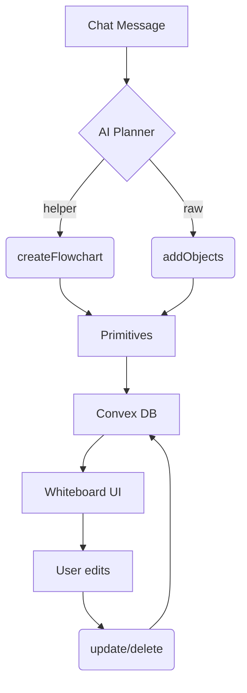

# Whiteboard V2 – Primitives-First Architecture

## 1. Goal
Provide a **stable, minimal contract** between the AI tutor, Convex backend, and the front-end whiteboard so that diagrams, tables, and other learning visuals can be created, edited, and versioned reliably.

## 2. Core Principles
1. **Primitives first** – The whiteboard understands only five immutable object kinds: `rect`, `ellipse`, `text`, `line`, `path` (plus optional `group` metadata).
2. **Helpers build on primitives** – Higher-level actions (e.g. `createFlowchart`) live in Convex and output primitives; the whiteboard never sees a bespoke format.
3. **Templates as data** – Common layouts are stored as JSON blobs of primitives. The AI can clone and customise them.
4. **Versioned & idempotent** – Each helper tags its output with `generator` and `version` in group metadata, enabling replay and future migration.
5. **Validation everywhere** – AI inputs and helper outputs are schema-validated in Convex before touching the DB.

## 3. Object Schema (never breaks)
```ts
interface WBRect   { kind: "rect";   id: string; x: number; y: number; width: number; height: number; fill?: string; stroke?: string; strokeWidth?: number; metadata?: Record<string, any>; }
interface WBEllipse{ kind: "ellipse"; id: string; x: number; y: number; rx: number; ry: number; fill?: string; stroke?: string; strokeWidth?: number; metadata?: Record<string, any>; }
interface WBText   { kind: "text";   id: string; x: number; y: number; text: string; fontSize?: number; fill?: string; textAnchor?: "start"|"middle"|"end"; metadata?: Record<string, any>; }
interface WBLine   { kind: "line";   id: string; points: number[]; stroke?: string; strokeWidth?: number; markerEnd?: "arrow"; metadata?: Record<string, any>; }
interface WBPath   { kind: "path";   id: string; d: string; stroke?: string; strokeWidth?: number; fill?: string; metadata?: Record<string, any>; }
```
All objects **must** include `metadata.groupId` so they can be moved, hidden, or deleted together.

## 4. Convex Actions
| Action | Input | Output | Purpose |
|--------|-------|--------|---------|
| `addObjects` | `{ sessionId, objects: WBObject[] }` | none | Bulk insert primitives |
| `updateObjects` | `{ sessionId, patch: Partial<WBObject> & { id: string }[] }` | none | Patch existing objects |
| `deleteObjects` | `{ sessionId, ids: string[] }` | none | Remove primitives |
| **Helpers** | | | |
| `createFlowchart` | `{ sessionId, steps: string[], theme?: Theme }` | `{ objects: WBObject[], payload }` | Returns primitives laid out in a circle or line |
| `createTimeline` | `{ sessionId, events: TimelineEvent[] }` | `{ objects, payload }` | Horizontal timeline |

Helpers generate group metadata: `{ groupId, generator: "flowchart", version: "1.0" }`.

## 5. Template Library
Location: `whiteboard_templates/*.json`
Each file contains a pristine array of primitives plus optional placeholder tokens (`{{TITLE}}`). The AI:
1. Loads template.
2. Replaces placeholders.
3. Calls `addObjects` once.

## 6. Data Flow


## 7. Rationale
• **Loose coupling** – Only primitives cross the network; helpers may evolve freely.  
• **Debuggability** – Broken diagrams are just JSON; inspect, diff, snapshot-test.  
• **Extensibility** – Add new helpers without front-end changes.  
• **Reliable migrations** – Group `generator` and `version` make batch upgrades trivial.

## 8. Migration Plan
1. Ship primitive actions in Convex (already done).  
2. Port helpers one by one, ensure snapshot tests pass.  
3. For existing boards, read legacy payload, regenerate primitives via helper, overwrite objects, tag `version: "1.0"`.  
4. Deprecate legacy helpers when metrics show zero calls.

## 9. Future Work
• Expose `image` primitive when needed.  
• Publish primitives schema as `@aitutor/whiteboard-schema` for third-party integration.  
• Move complex layout maths to WebWorker so users can edit helper-generated diagrams WYSIWYG.

## 10. Implementation Roadmap
The repository already contains many of the required pieces (primitive schema, Fabric renderer, Convex CRUD).  The tasks below convert the design into production code. 

### Phase 1 – Shared Schema Package
• Create `packages/whiteboard-schema/index.ts` and move `CanvasObjectSpec`, `WhiteboardAction`, and the five primitive type‐guards there.  
• Export the package from both the **frontend** and **convex** workspaces to guarantee a single source of truth.  
• Adjust all imports (`frontend/src/**`, `convex/**`) to pull types from `@aitutor/whiteboard-schema`.

### Phase 2 – Primitive Convex Mutations
File `convex/database/whiteboard.ts` already implements CRUD; extend it:  
1. Ensure every incoming object has `metadata.groupId` (fall back to `objectSpec.groupId ?? objectSpec.id`).  
2. Add `addObjectsBulk` mutation: `{ sessionId, objects: WBObject[] }`.

### Phase 3 – Helper Actions
New directory `convex/helpers/`
• `flowchart.ts`, `timeline.ts`, etc. Each action:  
  – Accept semantic input (`steps`, `events`).  
  – Generate primitives and tag group metadata `{ generator, version }`.  
  – **Return** the primitive array, caller will persist via `addObjectsBulk`.
• Delete the legacy `legacy/migration_bridge.drawDiagramSpecs` once helpers are live.

### Phase 4 – Skill Layer Wiring
`convex/skills/educational_content.ts`  
• Replace direct draw logic with calls to helper actions; persist via `addObjectsBulk`.

### Phase 5 – Front-end Updates
1. Hook `useConvexWhiteboard` → add `bulkAdd` that hits the new mutation.  
2. `fabricObjectFactory.ts` – confirm support for `ellipse`, `path`, `markerEnd:"arrow"`.  
3. Respect `metadata.groupId` for group operations.

### Phase 6 – Template Library
Folder `whiteboard_templates/` with JSON blobs (e.g. `flowchart6.json`).  
Utility `loadTemplate(name)` returns primitives for AI or user to customise.

### Phase 7 – Migration Script
`scripts/migrate_whiteboard_v1_to_v2.ts`  
• Read legacy actions, re-render via helpers, write primitives, tag version.

### Phase 8 – Automated Tests
• Snapshot-test each helper (`helpers/flowchart`, `helpers/timeline`).  
• Add a CI job that breaks on schema drift.

### Phase 9 – Documentation & Cleanup
• Update `README.md` & `DEVELOPER_GUIDE.md`.  
• After successful migration, remove deprecated legacy code.

> Milestone definition: each phase should pass tests and linting before moving on.