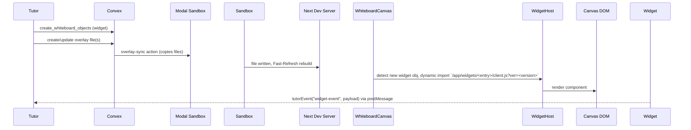

# Whiteboard Widgets – Detailed Implementation Plan

> Last updated: <!-- TODO: insert date automatically in future -->

## 1  Goals

| ID | Goal | Notes |
|----|------|-------|
| G-1 | Allow the AI-Tutor to place **React widgets** on the whiteboard when plain SVG/Canvas shapes are insufficient. | Widgets are client-side only; no SSR required. |
| G-2 | Keep the **host page safe** – widget code must execute solely inside the already-sandboxed iframe. | Parent page retains `sandbox="allow-scripts"` **without** `allow-same-origin`. |
| G-3 | Provide a **minimal SDK** so widgets can: ① hold React state, ② read/write Convex data, ③ send events to the Tutor. | SDK lives in `/app/widgets/widget-sdk.ts`. |
| G-4 | Support **hot-reload**: editing a widget overlay file should refresh the widget in-place without page reload. | Achieved via Next Fast Refresh + versioned `import()` cache-busting. |

Non-Goals for v1:
- Complex drag-and-drop between widgets.
- Widget server-side rendering.
- Global widget layout engine (grid, flexbox, etc.).

---

## 2  Folder & File Convention

```
/app/widgets/<entry>/client.tsx    # "use client" React component (default export)
/app/widgets/<entry>/index.ts      # (optional) server wrapper for future SSR
/app/widgets/widget-sdk.ts         # tiny helper re-export file (see §4)
```

**Important**: every widget entry file **must** start with the `"use client"` directive so Next treats it as a client component.  A future eslint rule should enforce this automatically.

*`<entry>`* must match the `entry` string in the whiteboard object:
```ts
{
  kind: "widget",
  entry: "fraction-explainer",   // ⬅️ folder name
  props: { numerator: 3, denominator: 4 },
  x: 400, y: 300, width: 160, height: 80,
  version: 1
}
```

Overlay sync copies any file whose path starts with `app/widgets/` into the sandbox. No custom webpack alias needed – they compile as normal Next.js client components.

---

## 3  Lifecycle & Data-Flow



Key points:
1. **Versioning** – `?ver=<object.version>` busts Next's module cache to re-import after edits.
2. **Isolation** – widget JS runs inside iframe only.
3. **Communication** – widgets send events via `window.parent.postMessage`; Tutor may reply with Convex actions.

---

## 4  Widget SDK (`app/widgets/widget-sdk.ts`)

```ts
"use client";
// Re-export React for convenience
export * from "react";

// Convex client helpers (runtime-safe dynamic import)
export { useQuery, useMutation } from "convex/react";

export function tutorEvent(type: string, payload?: any) {
  if (typeof window !== "undefined") {
    window.parent?.postMessage({ ns: "ai-tutor/wb", v: 1, type, payload }, "*");
  }
}
```

AI code sample:
```tsx
import { useState, tutorEvent } from "widget-sdk";

export default function Fraction({ numerator, denominator }) {
  const [flip, setFlip] = useState(false);
  const dec = (numerator / denominator).toFixed(2);

  return (
    <div onClick={() => { setFlip(!flip); tutorEvent("fraction-click", { numerator, denominator }); }}>
      {flip ? dec : `${numerator}/${denominator}`}
    </div>
  );
}
```

---

## 5  Implementation Road-map

### Phase A — Plumbing (≈1 day)
1. **Directory filter** in overlay-sync: copy only `/app/widgets/**` into sandbox.
2. In `WhiteboardCanvas`:
   - Replace placeholder div with `<WidgetHost>`.
   - Use `React.lazy` dynamic import path:
     ```ts
     const Widget = React.lazy(() =>
       import(
         /* @vite-ignore */ `/app/widgets/${encodeURIComponent(obj.entry)}/client.js?ver=${obj.version}`
       )
     );
     ```
     Encoding the entry ensures nested paths (`math/fraction`) work and the `?ver=` query busts Next's import cache.
   - Position host absolutely (`x`,`y`,`width`,`height`).
   - Wrap in `ErrorBoundary` + `Suspense` fallback.

### Phase B — SDK (½ day)
1. Add `widget-sdk.ts` (above) with `

### Phase D — Live-reload (½ day)
  – Listen for the `overlays-updated` postMessage and, for each existing widget host, compare `obj.version`; if it changed, re-import the module path above.
  – **Version bump helper**: when an overlay under `/app/widgets/…` is modified the overlay-patch mutation should also increment the corresponding whiteboard object's `version` field so cache-busting works.

---

## 6  Edge-case Notes & Safeguards

1. **Overlay sync glob** — copy *everything* under `app/widgets/**`, not just `*/client.*`.  This lets the AI create shared helpers like `utils.ts`.
2. **ErrorBoundary telemetry** — inside the boundary, send a postMessage `widget-error` with the stack so the tutor can prompt the AI to self-repair.
3. **SDK alias** — AI code should always import from `"widget-sdk"` (defined by `widget-sdk.ts`).  Keeps prompts short and avoids "use client" omissions.
4. **Iframe sandbox** — stay with `sandbox="allow-scripts"`; no `allow-same-origin`.  In `tutorEvent()` consider passing `window.origin` instead of `*` once we whitelist parent origin.
5. **Performance cap** — soft-limit to *≤ 50 widgets or ≤ 5 MB total widget JS* per session; `create_whiteboard_objects` should return an error if exceeded.
6. **Demo widget** — ship a `counter` widget in the template repo so manual dev testing is easy.
7. **Automated test** — integration test: edit overlay file, wait for `overlays-updated`, assert DOM updates in iframe.

--- 